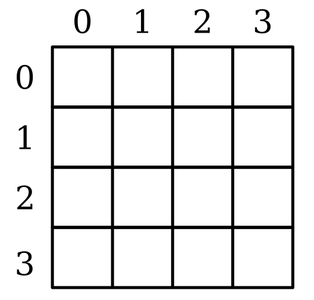
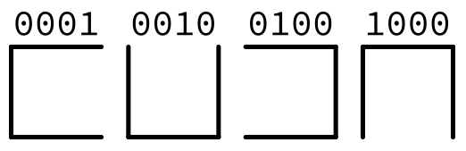

# Generador de Laberintos

## Descripción 
El proyecto es capaz de generar y resolver laberintos. Los laberintos son rectangulares y formados por cuartos cuadrados, con puertas Este, Norte, Oeste y Sur. Cada puerta tiene un puntaje entre 1 y 31; al pasar una puerta que conecte dos cuartos, el explorador del laberinto sufre una penalización proporcional al puntaje: por lo tanto, nos interesa que el explorador minimice el puntaje de las puertas por las que pase.


## Formato 
Los laberintos generados por el programa y los laberintos que el mismo reciba
para resolver serán archivos que tienen un formato que deben seguir al pie de la
letra:

1. Los primeros cuatro bytes del archivo deben ser 0x4d, 0x41, 0x5a y
0x45.

2. El siguiente byte (índice 0x04) nos dice el número de renglones en nuestra
matriz rectangular de cuartos. El valor mínimo válido del byte es 2.

3. El siguiente byte (0x05) nos dice el número de columnas en nuestra matriz
rectangular de cuartos. El valor mínimo válido del byte es 2.

4. Las dos reglas anteriores implican que nuestro laberinto más grande puede ser
de 255×255 cuartos; y el más pequeño puede ser de 2×2 cuartos.

5. Si los renglones son n y las columnas son m, entonces a partir del byte
0x06, los siguientes m×n bytes describen cada uno de los cuartos,
usando el sistema de coordenadas comúnmente usado en computadoras: la
coordenada (0,0) es la superior izquierda:



5. Con la primera coordenada especificando la columna y la segunda el renglón.
Por lo tanto el byte 0x06 representa el cuarto con coordenadas (0,0); el
byte 0x07 el de la coordenada (1,0); el byte 0x06 + m−1 el de la
coordenada (m−1,0); el el byte 0x06 + m el de la coordenada (m,1),
etc., hasta el byte 0x06 + m×n, que representará el cuarto en la
coordenada (m−1,n−1).

6. Los 4 bits menos significativos del byte de cada cuarto representan las
paredes que tiene el cuarto con sus 4 potenciales vecinos, en orden de menos
a más significativo, Este, Norte, Oeste y Sur; el bit en 1 quiere decir que
la pared sí existe (o que la puerta no existe), el bit en 0 quiere decir
que la pared no existe (o que la puerta sí existe):



7. Los 4 bits más significativos del byte de cada cuarto representan el puntaje
del cuarto (no de la puerta). Los valores 0000−1111, que corresponden a
0−15 en decimal serán el puntaje de cada cuarto. El puntaje de una puerta
es 1 más el puntaje de los 2 cuartos que conecta; por lo tanto el puntaje
mínimo de una puerta es 1 y el máximo es 31.

8. Todos los cuartos con coordenada (0,i), 0≤i<n, deben tener la pared
Oeste (el tercer bit menos significativo en 1); todos los cuartos con
coordenada (j,0), 0≤j<m, deben tener la pared Norte; todos los cuartos
con coordenada (m−1,i), 0≤i<n, deben tener la pared Sur; y todos los
cuartos con coordenada (j,n−1), 0≤j<m, deben tener la pared
Este. Estos son los cuartos frontera del laberinto; los que no están rodeados
de más cuartos del mismo laberinto. En otras palabras, no hay puertas que no
conecten 2 cuartos.
Sin embargo, exactamente 2 de estos cuartos deben violar la regla y tener una
puerta que no conecta con otro cuarto: estos 2 cuartos serán la entrada y
salida del laberinto. El primero en índice del byte en el archivo será la
entrada; el segundo será la salida. Si hay más de 2, el archivo se
considerará inválido.

9. Si un laberinto no tiene solución (no se puede recorrer del cuarto de entrada
al cuarto de salida), el archivo se considerará inválido.


## Uso del programa

Primero compilamos y generamos el .tar para correr el programa

```bash
$ mvn compile # compila el código
$ mvn install # genera el archivo laberinto.jar en el subdirectorio target
```

Luego, para utilizar el programa para generar un laberinto corremos el siguiente comando:
```bash
$ java -jar target/laberinto.jar -g -s 1234 -w 100 -h 100 > ejemplo.mze
```

El parámetro -g indica que vamos a generar un laberinto; el parámetro -s
seguido de un número es opcional: si no están no hay problema; pero si sí
están el número que debe seguir a -s es la semilla del generador de números
aleatorios utilizado: obviamente 1234 es un ejemplo, se puede utilizar
cualquier semilla que acepte el RNG. Si se omite el parámetro -s, el RNG debe
usar la semilla por omisión en Java (el reloj de la computadora).

El parámetro -w seguido de un número es cuántas columnas tendrá el laberinto;
de la misma manera, el parámetro -h seguido de un número es cuántos renglones
tendrá el laberinto. Ambos son obligatorios.

El orden de los parámetros no importa: -g puede estar antes de -w y -h, o
en medio, o después. Lo mismo con -w y -h: pero los tres siempre deben ser
seguidos de un número entero positivo o el programa debe terminar con un mensaje
para el usuario explicándole cómo debe ser invocado.

Ejecutar el proyecto con las mismas dimensiones y la misma semilla debe resultar
en el mismo laberinto siempre. En general, semillas distintas deben generar
laberintos distintos.

Al generar un laberinto, el mismo se manda a la salida externa únicamente.
Para resolver un laberinto, el proyecto se debe invocar como sigue:

```bash
$ java -jar target/laberinto.jar < ejemplo.mze > solucion.svg
```

O, de forma equivalente: 
```bash
$ cat ejemplo.mze | java -jar target/laberinto.jar > solucion.svg
```

El programa resolverá el laberinto y generará un archivo SVG con el dibujo del
laberinto y la solución.
